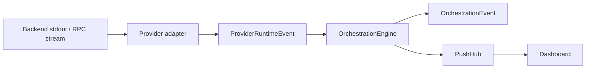
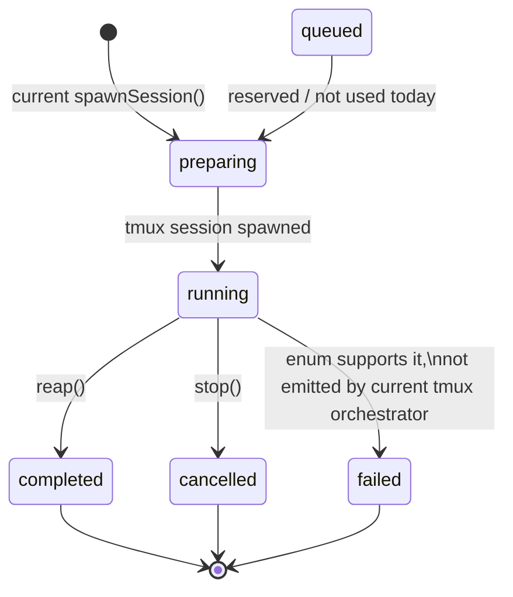
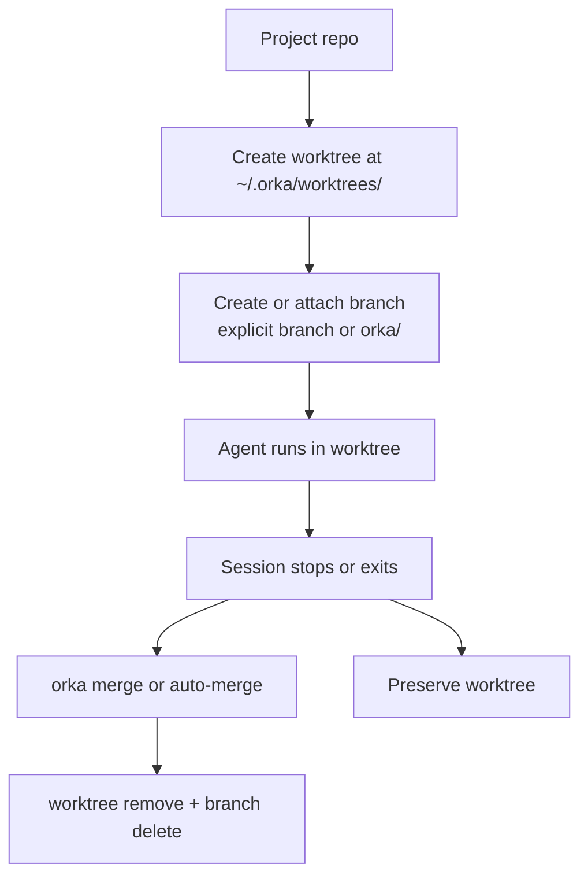

# Orka Architecture Reference

This document describes the current implementation in this repository. Where the code contains planned or partially integrated subsystems, that is called out explicitly rather than described as already live.

Primary source files:

- [`../packages/core/src/service.ts`](../packages/core/src/service.ts)
- [`../packages/core/src/types.ts`](../packages/core/src/types.ts)
- [`../packages/core/src/provider-events.ts`](../packages/core/src/provider-events.ts)
- [`../packages/core/src/rpc.ts`](../packages/core/src/rpc.ts)
- [`../packages/core/src/push-protocol.ts`](../packages/core/src/push-protocol.ts)
- [`../packages/core/src/crypto.ts`](../packages/core/src/crypto.ts)
- [`../packages/cli/src/index.ts`](../packages/cli/src/index.ts)
- [`../packages/daemon/src/local-client.ts`](../packages/daemon/src/local-client.ts)
- [`../packages/daemon/src/orchestrator.ts`](../packages/daemon/src/orchestrator.ts)
- [`../packages/daemon/src/server.ts`](../packages/daemon/src/server.ts)
- [`../packages/daemon/src/rpc-handler.ts`](../packages/daemon/src/rpc-handler.ts)
- [`../packages/daemon/src/db.ts`](../packages/daemon/src/db.ts)
- [`../packages/relay/src/index.ts`](../packages/relay/src/index.ts)
- [`../packages/dashboard/src/App.tsx`](../packages/dashboard/src/App.tsx)
- [`../packages/dashboard/src/lib/wsTransport.ts`](../packages/dashboard/src/lib/wsTransport.ts)

## 1. System Overview

Orka is an agent session orchestrator. It starts agent backends (`claude-code`, `codex`, or raw shell commands), isolates work in repository worktrees when needed, tracks sessions in SQLite, exposes a JSON-RPC WebSocket API, and serves a dashboard that streams session state and logs.

One important implementation detail: local CLI usage does not require a separately running daemon process. The CLI links against `packages/daemon` directly and instantiates `LocalClient` in-process. The WebSocket daemon path is used for remote access and for the dashboard.

```mermaid
flowchart LR
  CLI[orka CLI]
  Dashboard[Dashboard SPA]
  Relay[Relay]

  subgraph DaemonHost[Daemon Host]
    Daemon[Orka daemon\nBun.serve + OrkaService]
    DB[(SQLite)]
    Tmux[tmux]
    Git[git worktrees]
    Logs[session logs]
  end

  CLI -->|local mode:\ncreateLocalClient()| Daemon
  CLI -->|--remote JSON-RPC over WS| Relay
  Relay -->|forward JSON-RPC| Daemon
  Dashboard -->|WS + push| Daemon

  Daemon --> DB
  Daemon --> Tmux
  Daemon --> Git
  Daemon --> Logs
```

### How the pieces connect

- The CLI resolves an `OrkaService` implementation at startup. Without `--remote`, it uses `LocalClient`; with `--remote`, it uses `RemoteClient` over WebSocket. See [`../packages/cli/src/index.ts`](../packages/cli/src/index.ts).
- The daemon server exposes `OrkaService` over JSON-RPC 2.0 via `Bun.serve`, and also emits push messages through `PushHub`. See [`../packages/daemon/src/server.ts`](../packages/daemon/src/server.ts) and [`../packages/daemon/src/rpc-handler.ts`](../packages/daemon/src/rpc-handler.ts).
- The dashboard talks directly to the daemon WebSocket endpoint, not to the relay. The browser transport expects push channels that the relay does not proxy today. See [`../packages/dashboard/src/lib/wsTransport.ts`](../packages/dashboard/src/lib/wsTransport.ts).
- The relay is for multi-machine CLI-to-daemon routing. It forwards JSON-RPC requests and responses between authenticated clients and registered daemon nodes while remaining mostly payload-agnostic. See [`../packages/relay/src/index.ts`](../packages/relay/src/index.ts).

## 2. Component Architecture

### CLI (`packages/cli`)

Source: [`../packages/cli/src/index.ts`](../packages/cli/src/index.ts)

The CLI is a `cmd-ts` application that does three jobs:

1. Parse commands and flags.
2. Resolve an `OrkaService` transport.
3. Wrap command execution in tracing and common pre-flight behavior.

#### Service resolution

At process startup, the CLI strips transport-specific flags from `process.argv` before `cmd-ts` sees them:

- `--remote` or `ORKA_REMOTE`
- `--token`, `ORKA_TOKEN`, or `ORKA_API_KEY`
- `--encrypt` or `ORKA_ENCRYPT`
- `--server-key` or `ORKA_SERVER_KEY`

Resolution logic:

- No `--remote`: `svc = createLocalClient()`
- `--remote` without encryption: `svc = createRemoteClient(remoteUrl)`
- `--remote --encrypt`: generate/load a client X25519 keypair, load the server public key, and create `RemoteClient` with E2E crypto enabled

This means "CLI -> daemon" can mean either:

- in-process library calls into `LocalClient`, or
- WebSocket JSON-RPC calls through `RemoteClient`

#### Command dispatch

Every top-level command runs through:

```ts
async function runCliCommand(name: string, fn: () => Promise<void>): Promise<void> {
  await withSpan(`orka.cli.${name}`, { "orka.command": name }, async () => {
    if (name !== "wait") {
      await svc.reap();
    }
    await fn();
  });
}
```

Operational consequences:

- Most CLI commands opportunistically reap completed tmux sessions before doing their real work.
- CLI command spans use the `orka.cli.<command>` naming convention.
- `serve` starts the daemon server.
- `relay serve` starts the relay.
- `keygen` manages E2E key material under `~/.orka/keys/`.

### Daemon (`packages/daemon`)

Primary sources:

- [`../packages/daemon/src/local-client.ts`](../packages/daemon/src/local-client.ts)
- [`../packages/daemon/src/orchestrator.ts`](../packages/daemon/src/orchestrator.ts)
- [`../packages/daemon/src/server.ts`](../packages/daemon/src/server.ts)
- [`../packages/daemon/src/db.ts`](../packages/daemon/src/db.ts)

The daemon package is a library, not a single class. Its runtime architecture is composed from modules.

#### `LocalClient`

`LocalClient` is the in-process `OrkaService` implementation. It delegates to:

- SQLite helpers in [`../packages/daemon/src/db.ts`](../packages/daemon/src/db.ts)
- tmux/worktree orchestration in [`../packages/daemon/src/orchestrator.ts`](../packages/daemon/src/orchestrator.ts)
- git worktree helpers in [`../packages/daemon/src/worktree.ts`](../packages/daemon/src/worktree.ts)
- `TerminalManager` in [`../packages/daemon/src/terminal-manager.ts`](../packages/daemon/src/terminal-manager.ts)
- `ApprovalManager` in [`../packages/daemon/src/approval-manager.ts`](../packages/daemon/src/approval-manager.ts)

#### Orchestrator

The classic execution path is tmux-driven, not provider-adapter-driven.

`spawnSession()`:

- validates the backend binary
- allocates ids (`task-*`, `sess-*`, `ws-*`)
- optionally creates a git worktree
- writes a session shell script to `~/.orka/scripts/<session>.sh`
- starts a detached tmux session
- persists task/session rows
- moves session state to `running`

`reapSessions()`:

- lists running sessions from SQLite
- compares them with live tmux sessions
- persists final diff/status snapshots
- marks finished sessions `completed`
- optionally auto-merges worktrees

`stopSession()`:

- kills the tmux session
- persists diff/status
- marks the session `cancelled`
- tries to clean up the worktree if safe

#### Backends

There are two backend layers in the daemon package:

1. The live tmux execution layer in [`../packages/daemon/src/backends.ts`](../packages/daemon/src/backends.ts)
2. The newer provider-adapter layer in [`../packages/daemon/src/adapters/`](../packages/daemon/src/adapters/)

The live tmux layer builds shell commands such as:

- `claude -p --verbose --output-format stream-json --permission-mode auto ...`
- `codex exec --dangerously-bypass-approvals-and-sandbox --json ...`
- raw shell prompt text

The provider-adapter layer contains:

- `ClaudeCodeAdapter`
- `CodexAdapter`
- `ShellAdapter`
- `ProviderService`
- `ProviderAdapterRegistry`

That subsystem exists and is tested, but it is not currently wired into `spawnSession()`, `startServer()`, or the dashboard. See Section 4.

#### Database

The daemon persists state in SQLite via `bun:sqlite` at `~/.orka/orka.db`. The DB module also owns schema migrations and row mapping. See [`../packages/daemon/src/db.ts`](../packages/daemon/src/db.ts).

#### Server

`startServer()` creates a `Bun.serve` instance that:

- serves `GET /health`
- upgrades all other valid requests to WebSocket
- accepts push-control messages (`subscribe` / `unsubscribe`)
- dispatches JSON-RPC requests via `handleRpcRequest()`
- optionally derives per-connection encryption keys when E2E is enabled
- optionally registers the daemon as a node with a relay

#### Push and streaming helpers

- `PushHub`: in-memory pub/sub fanout for WebSocket clients
- `LogTailer`: polling log streamer
- `TerminalManager`: PTY-based ad hoc shells for dashboard terminals
- `ApprovalManager`: in-memory approval request store

### Core (`packages/core`)

Primary sources:

- [`../packages/core/src/service.ts`](../packages/core/src/service.ts)
- [`../packages/core/src/types.ts`](../packages/core/src/types.ts)
- [`../packages/core/src/provider-events.ts`](../packages/core/src/provider-events.ts)
- [`../packages/core/src/provider-adapter.ts`](../packages/core/src/provider-adapter.ts)
- [`../packages/core/src/crypto.ts`](../packages/core/src/crypto.ts)

`packages/core` is the contract package shared by CLI, daemon, relay, and dashboard. It contains:

- the `OrkaService` interface
- domain types such as `Session`, `Task`, and `SpawnRequest`
- zod schemas for enums and protocol types
- provider runtime event types
- provider adapter interfaces
- JSON-RPC and push protocol definitions
- reconnection backoff logic
- X25519 + HKDF-SHA256 + AES-256-GCM crypto helpers

Representative type definitions:

```ts
export interface Session {
  id: SessionId;
  taskId: TaskId;
  workspaceId: WorkspaceId;
  status: SessionStatus;
  backend: BackendKind;
  mode: SessionMode;
  tmuxSessionName: string;
  projectPath: string;
  workingDir: string;
  logFile: string;
  createdAt: string;
  startedAt: string | null;
  finishedAt: string | null;
  exitCode: number | null;
  kept: boolean;
  autoMerge: boolean;
}

export interface SpawnRequest {
  prompt: string;
  title?: string;
  projectPath: string;
  backend: BackendKind;
  mode: SessionMode;
  branch?: string;
  model?: string;
  reasoningEffort?: ReasoningEffort;
  autoMerge?: boolean;
  tags?: string[];
}
```

### Relay (`packages/relay`)

Primary sources:

- [`../packages/relay/src/index.ts`](../packages/relay/src/index.ts)
- [`../packages/relay/src/state.ts`](../packages/relay/src/state.ts)
- [`../packages/relay/src/auth.ts`](../packages/relay/src/auth.ts)
- [`../packages/relay/src/rate-limiter.ts`](../packages/relay/src/rate-limiter.ts)
- [`../packages/relay/src/abuse.ts`](../packages/relay/src/abuse.ts)
- [`../packages/relay/src/metering.ts`](../packages/relay/src/metering.ts)

The relay is a transparent, account-scoped WebSocket router between remote clients and daemon nodes.

Responsibilities:

- authenticate API keys
- register daemon nodes under an account
- track account-local client and node sockets
- pick a node for each request
- forward JSON-RPC payloads as-is
- enforce method allow-lists and rate limits
- meter requests/responses/connections into SQLite
- keep account isolation boundaries

Important implementation limits:

- The relay only forwards a subset of `OrkaService` methods. `getUsage`, terminal methods, and approval methods are not in `ALLOWED_METHODS` today. See [`../packages/relay/src/index.ts`](../packages/relay/src/index.ts).
- The relay currently routes JSON-RPC request/response traffic only. It does not proxy the daemon's push-channel subscription protocol for the dashboard.
- Cluster support is currently a single-instance stub (`SingleInstanceCluster`).

### Dashboard (`packages/dashboard`)

Primary sources:

- [`../packages/dashboard/src/App.tsx`](../packages/dashboard/src/App.tsx)
- [`../packages/dashboard/src/lib/wsTransport.ts`](../packages/dashboard/src/lib/wsTransport.ts)
- [`../packages/dashboard/src/stores/sessionStore.ts`](../packages/dashboard/src/stores/sessionStore.ts)
- [`../packages/dashboard/src/stores/connectionStore.ts`](../packages/dashboard/src/stores/connectionStore.ts)
- [`../packages/dashboard/src/components/SessionView.tsx`](../packages/dashboard/src/components/SessionView.tsx)

The dashboard is a React 19 SPA with three main data layers:

- `WsTransport` for WebSocket JSON-RPC and push messages
- Zustand stores for session and connection state
- React Query for query caching on expensive/detail views

Current component tree:

```text
App
├── Sidebar
├── SessionView
│   ├── Overview tab
│   ├── Chat tab
│   ├── Logs tab
│   └── Diff tab
├── NewSessionDialog
└── StatusBar
```

Important behavior:

- `App` subscribes to `orchestration.sessionUpdated` and `orchestration.sessionDeleted`.
- `LogPanel` subscribes to `session.logLine`.
- `SessionStore` fetches `listSessions` first, then issues `getTask` per session to decorate titles/models/prompts.
- `ChatView` is still placeholder UI backed by synthetic entries, not live orchestration events. See [`../packages/dashboard/src/components/ChatView.tsx`](../packages/dashboard/src/components/ChatView.tsx).

## 3. OrkaService Contract

Source: [`../packages/core/src/service.ts`](../packages/core/src/service.ts)

### Full interface

```ts
export interface OrkaService {
  spawn(req: SpawnRequest): Promise<Session>;
  stop(sessionId: string): Promise<void>;
  reap(): Promise<number>;

  getSession(id: string): Promise<Session | null>;
  listSessions(filters?: SessionFilters): Promise<Session[]>;
  getTask(id: string): Promise<Task | null>;

  setKept(sessionId: string, kept: boolean): Promise<void>;
  getTags(sessionId: string): Promise<string[]>;

  getResult(sessionId: string): Promise<SessionResult | null>;
  getUsage(opts?: { sessionId?: string; since?: string; backend?: string }): Promise<UsageSummary>;
  captureOutput(sessionId: string): Promise<string>;
  getLogContent(sessionId: string): Promise<string | null>;
  isAlive(sessionId: string): Promise<boolean>;
  sendInput(sessionId: string, text: string): Promise<void>;

  getDiff(sessionId: string): Promise<DiffResult>;
  merge(sessionId: string, cleanup?: boolean): Promise<MergeResult>;

  deleteSessions(ids: string[]): Promise<void>;
  pruneSessions(opts: PruneOptions): Promise<PruneResult>;

  getPendingApprovals(sessionId?: string): Promise<ApprovalRequest[]>;
  resolveApproval(requestId: string, decision: ApprovalDecision): Promise<void>;

  terminalOpen(sessionId: string, opts?: { cols?: number; rows?: number }): Promise<{ termId: string }>;
  terminalWrite(termId: string, data: string): Promise<void>;
  terminalResize(termId: string, cols: number, rows: number): Promise<void>;
  terminalClose(termId: string): Promise<void>;
  terminalList(sessionId: string): Promise<Array<{ id: string; cols: number; rows: number }>>;
}
```

### Implementation model

- `LocalClient` implements each method directly against SQLite, tmux, git, and local files. See [`../packages/daemon/src/local-client.ts`](../packages/daemon/src/local-client.ts).
- `RemoteClient` implements the same interface by sending JSON-RPC requests over WebSocket. See [`../packages/daemon/src/remote-client.ts`](../packages/daemon/src/remote-client.ts).

Representative `RemoteClient` call path:

```ts
private async call(method: string, params?: any): Promise<any> {
  await this.connect();
  const id = String(this.nextId++);
  let req: any = { jsonrpc: "2.0", id, method, ...(params !== undefined ? { params } : {}) };
  if (this.encKey && req.params) {
    req = encryptRequest(this.encKey, req);
  }
  this.ws!.send(JSON.stringify(req));
  ...
}
```

### Method-by-method semantics

| Method | Semantics | `LocalClient` implementation | `RemoteClient` implementation | Common error conditions | Push side effects |
| --- | --- | --- | --- | --- | --- |
| `spawn(req)` | Create a task and session, optionally create a worktree, write a script, start tmux, return session metadata. | `spawnSession(req)` | JSON-RPC `spawn` | backend binary missing, concurrent limit exceeded, git/tmux failures, DB write failures | `rpc-handler` broadcasts `orchestration.sessionUpdated` for the new session |
| `stop(sessionId)` | Stop a running/preparing session. | `stopSession(sessionId)` | JSON-RPC `stop` | unknown session id, tmux kill failure | `stopSession()` broadcasts `orchestration.sessionUpdated`; `rpc-handler` broadcasts again after reading the updated row |
| `reap()` | Finalize sessions whose tmux process exited. Returns number reaped. | `reapSessions()` | JSON-RPC `reap` | mostly best-effort; tmux/git failures are selectively ignored | each reaped session broadcasts `orchestration.sessionUpdated` with `completed` |
| `getSession(id)` | Return a session row or `null`. | `getSession(id)` | JSON-RPC `getSession` | none besides transport/server failure | none |
| `listSessions(filters)` | Return sessions, optionally filtered by status or tag. | `dbListSessions` or `listSessionsByTag` | JSON-RPC `listSessions` | none besides transport/server failure | none |
| `getTask(id)` | Return a task row or `null`. | `getTask(id)` | JSON-RPC `getTask` | none besides transport/server failure | none |
| `setKept(sessionId, kept)` | Toggle worktree protection on a session. | `setSessionKept(...)` | JSON-RPC `setKept` | unknown session silently updates zero rows; transport/server failure can still occur | none |
| `getTags(sessionId)` | Return session tags sorted by tag. | `getSessionTags(sessionId)` | JSON-RPC `getTags` | none besides transport/server failure | none |
| `getResult(sessionId)` | Parse a finished session log into structured result/usage. | reads log path from session, runs `parseSessionResult()`, then inserts a usage row if parsed | JSON-RPC `getResult` | returns `null` if no session/log/result; parse failure is treated as no result | none |
| `getUsage(opts)` | Aggregate usage globally or for one session. | DB aggregation or in-memory filter over session usage rows | JSON-RPC `getUsage` | transport/server failure; no typed domain error | none |
| `captureOutput(sessionId)` | Read live output from tmux if still running, otherwise fall back to the saved log file. | tmux `capture-pane` or `readFileSync(logFile)` | JSON-RPC `captureOutput` | session not found, no output/log available | none |
| `getLogContent(sessionId)` | Return full log contents or `null`. | read log file if it exists | JSON-RPC `getLogContent` | none besides transport/server failure | none |
| `isAlive(sessionId)` | Return whether the tmux session still exists. | `runner.has(tmuxSessionName)` | JSON-RPC `isAlive` | none besides transport/server failure | none |
| `sendInput(sessionId, text)` | Send text plus Enter into the session tmux pane. | `runner.sendText(...)` | JSON-RPC `sendInput` | session not found, session not running, tmux failure | none |
| `getDiff(sessionId)` | Return `git status` and `git diff` for the session working dir. | runs git directly, falls back to persisted `last_diff` | JSON-RPC `getDiff` | session not found, working dir missing and no persisted diff | none |
| `merge(sessionId, cleanup)` | Merge a session worktree branch into the main repo, optionally cleaning up worktree and branch. | `worktreeMerge()` then optional `worktreeRemove()` + `deleteBranch()` | JSON-RPC `merge` | session not found, not a worktree session, no commits to merge, git merge/rebase failure | none |
| `deleteSessions(ids)` | Delete sessions, related tags/usage, and now-orphaned tasks. | `dbDeleteSessions(ids)` | JSON-RPC `deleteSessions` | no-op for empty list; DB failure otherwise | `rpc-handler` broadcasts `orchestration.sessionDeleted` once per id |
| `pruneSessions(opts)` | Dry-run or delete old completed/cancelled/failed sessions; optionally purge logs and DB rows; always prune orphaned worktrees on confirm. | implemented in `LocalClient.pruneSessions()` | JSON-RPC `pruneSessions` | filesystem/DB failures may bubble | none |
| `getPendingApprovals(sessionId?)` | Return unresolved approval requests. | in-memory `ApprovalManager` query | JSON-RPC `getPendingApprovals` | none besides transport/server failure | none |
| `resolveApproval(requestId, decision)` | Resolve an approval request. | `ApprovalManager.resolve(...)` | JSON-RPC `resolveApproval` | throws if request does not exist or is already resolved | none |
| `terminalOpen(sessionId, opts)` | Open a new PTY shell in the session working dir. This is separate from the agent tmux session. | `TerminalManager.open(...)` | JSON-RPC `terminalOpen` | session not found; `node-pty` unavailable | none |
| `terminalWrite(termId, data)` | Write raw bytes to a PTY. | `TerminalManager.write(...)` | JSON-RPC `terminalWrite` | terminal not found | none |
| `terminalResize(termId, cols, rows)` | Resize a PTY. | `TerminalManager.resize(...)` | JSON-RPC `terminalResize` | terminal not found | none |
| `terminalClose(termId)` | Kill and forget a PTY. | `TerminalManager.close(...)` | JSON-RPC `terminalClose` | terminal not found | none |
| `terminalList(sessionId)` | List PTYs associated with a session. | `TerminalManager.listForSession(...)` | JSON-RPC `terminalList` | none besides transport/server failure | none |

### Notes on error behavior

- The interface does not define typed error envelopes at the TypeScript level; most domain failures throw plain `Error`.
- `RemoteClient` turns JSON-RPC error responses into thrown `Error(resp.error.message)`.
- When the relay is in the path, method allow-list enforcement can reject otherwise valid `RemoteClient` methods. This is a relay behavior, not an `OrkaService` behavior.

### Which operations trigger push events

Current push producers:

- `spawn` through `rpc-handler`: `orchestration.sessionUpdated`
- `stop`: `orchestration.sessionUpdated` from `stopSession()`, then another from `rpc-handler`
- `reap`: `orchestration.sessionUpdated` for every completed session
- `deleteSessions`: `orchestration.sessionDeleted` per deleted session
- `LogTailer`: `session.logLine`
- server open: `server.welcome`
- graceful shutdown: `server.shutdown`
- `OrchestrationEngine.ingest(...)`: `orchestration.event` and `orchestration.sessionUpdated` if that subsystem is used

## 4. Event Sourcing Architecture

Primary sources:

- [`../packages/core/src/provider-events.ts`](../packages/core/src/provider-events.ts)
- [`../packages/daemon/src/adapters/claude-adapter.ts`](../packages/daemon/src/adapters/claude-adapter.ts)
- [`../packages/daemon/src/adapters/codex-adapter.ts`](../packages/daemon/src/adapters/codex-adapter.ts)
- [`../packages/daemon/src/adapters/shell-adapter.ts`](../packages/daemon/src/adapters/shell-adapter.ts)
- [`../packages/daemon/src/provider-service.ts`](../packages/daemon/src/provider-service.ts)
- [`../packages/daemon/src/orchestration/engine.ts`](../packages/daemon/src/orchestration/engine.ts)
- [`../packages/daemon/src/orchestration/ingestion.ts`](../packages/daemon/src/orchestration/ingestion.ts)

### Current status

This subsystem exists in the daemon package and is tested, but it is not currently wired into:

- `spawnSession()` in the tmux-based orchestrator
- `startServer()` / `handleRpcRequest()`
- the dashboard `ChatView`

So the design below is implemented code, but not yet the live path for normal CLI/dashboard sessions.

### ProviderRuntimeEvent hierarchy

Common event base:

```ts
export interface ProviderRuntimeEventBase {
  eventId: string;
  provider: BackendKind;
  threadId: string;
  createdAt: string;
  turnId?: string;
  itemId?: string;
  requestId?: string;
}
```

The 15 concrete runtime event types are:

1. `session.started`
2. `session.state.changed`
3. `session.exited`
4. `turn.started`
5. `turn.completed`
6. `turn.aborted`
7. `item.started`
8. `item.updated`
9. `item.completed`
10. `content.delta`
11. `request.opened`
12. `request.resolved`
13. `tool.progress`
14. `runtime.error`
15. `runtime.warning`

Payload semantics:

- session lifecycle: startup, state changes, exit
- turn lifecycle: begin, complete, abort
- item lifecycle: tools, commands, file operations, reasoning items
- content streaming: assistant text, reasoning text, command output, file change output
- request lifecycle: approvals or user-input requests
- diagnostics: warnings and errors

### Backend adapters and normalization

#### Claude Code adapter

Source: [`../packages/daemon/src/adapters/claude-adapter.ts`](../packages/daemon/src/adapters/claude-adapter.ts)

Process launched:

```text
claude -p --verbose --output-format stream-json --permission-mode auto
```

Normalization highlights:

- `system/init` -> `session.started`
- assistant text -> `content.delta` with `streamKind: "assistant_text"`
- tool use blocks -> `item.started`
- tool completion messages -> `item.completed`
- final `result` event -> `turn.completed`
- final `result` event also generates synthetic `session.exited` in "exit" mapping mode

#### Codex adapter

Source: [`../packages/daemon/src/adapters/codex-adapter.ts`](../packages/daemon/src/adapters/codex-adapter.ts)

Current implementation detail: the provider adapter uses `codex app-server`, not `codex exec --json`.

Normalization highlights:

- `session.started` -> `session.started`
- `turn.started` -> `turn.started`
- `message.delta` -> `content.delta` (`assistant_text`)
- `command.start` -> `item.started` (`command_execution`)
- `command.output` -> `content.delta` (`command_output`)
- `turn.completed` -> `turn.completed`
- `session.ended` -> `session.exited`

Separate but related note: the tmux/background execution path still uses `codex exec --json`, and `result-parser.ts` knows how to parse that JSONL output after the fact. That parsing path is not the same thing as the provider-adapter event stream.

#### Shell adapter

Source: [`../packages/daemon/src/adapters/shell-adapter.ts`](../packages/daemon/src/adapters/shell-adapter.ts)

The shell adapter:

- writes a shell script under `~/.orka/provider-scripts/`
- spawns it in tmux via the injected `SessionRunner`
- polls `capture-pane`
- diffs each capture against the last capture

Normalization highlights:

- session start -> `session.started`
- stdout delta -> `content.delta` (`command_output`)
- polling failures -> `runtime.error`
- process exit -> `session.exited`

### OrchestrationEngine

Source: [`../packages/daemon/src/orchestration/engine.ts`](../packages/daemon/src/orchestration/engine.ts)

`OrchestrationEngine` is an in-memory event log plus projection engine:

- `log: OrchestrationEvent[]`
- `listeners: Array<(event) => void>`
- optional `PushHub` integration

Projection type:

```ts
export interface SessionProjection {
  sessionId: string;
  status: "created" | "started" | "running" | "completed" | "failed";
  currentTurnId: string | null;
  totalCost: number;
  totalTokens: {
    input: number;
    output: number;
  };
  pendingRequests: Array<{ requestId: string; requestType: string }>;
}
```

`ingest(sessionId, providerEvent)` does four things:

1. maps the provider event to an `OrchestrationEvent`
2. appends it to the in-memory log
3. notifies listeners
4. broadcasts `orchestration.event` and `orchestration.sessionUpdated` through `PushHub`

### OrchestrationEvent types

Source: [`../packages/daemon/src/orchestration/events.ts`](../packages/daemon/src/orchestration/events.ts)

Declared event union:

- `session.created`
- `session.started`
- `session.completed`
- `session.failed`
- `turn.started`
- `turn.completed`
- `content.delta`
- `request.opened`
- `request.resolved`

Current semantics in code:

| Orchestration event | Meaning | Currently produced by ingestion? |
| --- | --- | --- |
| `session.created` | logical session creation | no |
| `session.started` | provider session actually started | yes |
| `session.completed` | provider session exited | yes |
| `session.failed` | session failed with error | no |
| `turn.started` | a model turn began | yes |
| `turn.completed` | a model turn finished, with optional usage/cost | yes |
| `content.delta` | streamed content chunk | yes |
| `request.opened` | approval/user-input request opened | yes |
| `request.resolved` | request resolved | yes |

### Ingestion mapping

Source: [`../packages/daemon/src/orchestration/ingestion.ts`](../packages/daemon/src/orchestration/ingestion.ts)

Current mapping:

| ProviderRuntimeEvent | OrchestrationEvent |
| --- | --- |
| `session.started` | `session.started` |
| `turn.started` | `turn.started` |
| `content.delta` | `content.delta` |
| `turn.completed` | `turn.completed` |
| `session.exited` | `session.completed` with `exitCode: null` |
| `request.opened` | `request.opened` |
| `request.resolved` | `request.resolved` |

Everything else is currently dropped:

- `session.state.changed`
- `turn.aborted`
- `item.started`
- `item.updated`
- `item.completed`
- `tool.progress`
- `runtime.error`
- `runtime.warning`

That means the engine's current projection is intentionally narrower than the provider event vocabulary.

### Event flow



Current integration note:

- The flow above is implemented at the package level.
- The live daemon/dashboard path today still uses tmux logs plus `sessionUpdated` pushes, not `OrchestrationEngine`.

### Checkpoints

Related sources:

- [`../packages/daemon/src/orchestration/checkpoint.ts`](../packages/daemon/src/orchestration/checkpoint.ts)
- [`../packages/daemon/src/orchestration/checkpoint-reactor.ts`](../packages/daemon/src/orchestration/checkpoint-reactor.ts)

`CheckpointService` records git commit snapshots on turn boundaries and can diff or roll back between checkpoints. `CheckpointReactor` listens for `turn.started` and `turn.completed` and captures `turn_start` / `turn_end` checkpoints. This is another implemented but not yet live-integrated part of the event-sourced subsystem.

## 5. Real-Time Push Architecture

Primary sources:

- [`../packages/daemon/src/push-hub.ts`](../packages/daemon/src/push-hub.ts)
- [`../packages/core/src/push-protocol.ts`](../packages/core/src/push-protocol.ts)
- [`../packages/daemon/src/log-tailer.ts`](../packages/daemon/src/log-tailer.ts)
- [`../packages/dashboard/src/lib/wsTransport.ts`](../packages/dashboard/src/lib/wsTransport.ts)

### PushHub

`PushHub` is an in-memory broker keyed by `PushChannel`.

Internal state:

- `subscribers: Map<PushChannel, Set<WebSocket>>`
- `subscriptions: Map<WebSocket, Set<PushChannel>>`
- `sequences: Map<WebSocket, number>`

Key behaviors:

- subscriptions are per channel and per socket
- sequence numbers are per socket, not global
- `server.welcome` can be sent directly to a socket without a subscription
- disconnect cleanup removes reverse subscriptions and sequence state

### Push channels

The current code defines exactly six push channels:

```ts
export const PushChannelSchema = z.enum([
  "server.welcome",
  "server.shutdown",
  "orchestration.sessionUpdated",
  "orchestration.sessionDeleted",
  "orchestration.event",
  "session.logLine",
]);
```

Semantics:

- `server.welcome`: sent once on socket open with daemon version and current session count
- `server.shutdown`: broadcast during graceful shutdown
- `orchestration.sessionUpdated`: session lifecycle/status changed
- `orchestration.sessionDeleted`: session deleted from DB
- `orchestration.event`: event-sourced orchestration event
- `session.logLine`: incremental log-file bytes for active sessions

Important precision point: there is no `session.chatMessage` channel in the current implementation. The dashboard chat tab is placeholder UI, not a live push consumer.

### LogTailer

Source: [`../packages/daemon/src/log-tailer.ts`](../packages/daemon/src/log-tailer.ts)

`LogTailer` uses polling, not `fs.watch`.

Behavior:

- default poll interval: 500 ms
- if nobody is subscribed to `session.logLine`, it does nothing
- each tick calls `svc.listSessions()`
- only `running` and `preparing` sessions are tailed
- offsets are tracked per session id
- when file size increases, only the unread suffix is read and pushed

Push payload:

```ts
export interface SessionLogLineData {
  sessionId: string;
  content: string;
  offset: number;
}
```

Important consequence: all subscribers to `session.logLine` receive log deltas for all sessions. Session-level filtering is currently done in the browser, inside `LogPanel`.

### WsTransport

Source: [`../packages/dashboard/src/lib/wsTransport.ts`](../packages/dashboard/src/lib/wsTransport.ts)

`WsTransport` combines three protocol roles:

- JSON-RPC request/response client
- push subscription client
- reconnecting connection manager

Request/response behavior:

- numeric request ids in the browser transport
- pending request map keyed by id
- one timeout per request
- sent requests are rejected on disconnect
- unsent queued requests stay in `outbox` and are retried after reconnect

Push behavior:

- per-channel handler sets
- latest pushed value cached per channel
- new subscribers immediately replay the latest cached value for that channel
- subscriptions are resynchronized after reconnect

Reconnect behavior:

- initial delay: 500 ms
- doubles up to `maxReconnectDelay` (default 8 s)
- state transitions: `connecting -> connected -> reconnecting -> connected`
- reconnect is opt-in via `connect()` or any request/subscribe operation that needs a connection

### Dashboard subscription flow

Sources:

- [`../packages/dashboard/src/App.tsx`](../packages/dashboard/src/App.tsx)
- [`../packages/dashboard/src/components/LogPanel.tsx`](../packages/dashboard/src/components/LogPanel.tsx)

On startup:

1. `App` creates one `WsTransport`.
2. `App` subscribes to:
   - `orchestration.sessionUpdated`
   - `orchestration.sessionDeleted`
3. `App` binds transport state changes into `connectionStore`.
4. `App` issues `listSessions`, then per-session `getTask`.

Per selected session:

1. `LogPanel` fetches `getLogContent`.
2. `LogPanel` subscribes to `session.logLine`.
3. If a pushed `offset` equals the expected byte count, it appends.
4. If a gap is detected, it refetches the full log.

Reconnection behavior:

- `WsTransport` re-sends active subscriptions on reconnect
- cached latest push values replay to newly added handlers
- `App` refetches sessions when a `sessionUpdated` arrives for an unknown session id

## 6. Data Model

Primary source: [`../packages/daemon/src/db.ts`](../packages/daemon/src/db.ts)

### SQLite schema

The daemon database lives at `~/.orka/orka.db`.

#### `sessions`

Current persisted columns:

| Column | Type | Notes |
| --- | --- | --- |
| `id` | `TEXT PRIMARY KEY` | session id, eg `sess-...` |
| `task_id` | `TEXT NOT NULL` | foreign key to `tasks(id)` |
| `workspace_id` | `TEXT NOT NULL` | logical workspace id |
| `status` | `TEXT NOT NULL` | `queued`, `preparing`, `running`, `completed`, `failed`, `cancelled` |
| `backend` | `TEXT NOT NULL` | `claude-code`, `codex`, `shell` |
| `mode` | `TEXT NOT NULL` | `interactive` or `background` |
| `tmux_session_name` | `TEXT NOT NULL` | tmux session backing the run |
| `project_path` | `TEXT NOT NULL DEFAULT ''` | repository root |
| `working_dir` | `TEXT NOT NULL` | repo root or worktree path |
| `log_file` | `TEXT NOT NULL DEFAULT ''` | log file path |
| `created_at` | `TEXT NOT NULL` | ISO timestamp |
| `started_at` | `TEXT` | nullable |
| `finished_at` | `TEXT` | nullable |
| `exit_code` | `INTEGER` | nullable |
| `kept` | `INTEGER NOT NULL DEFAULT 0` | boolean-like |
| `auto_merge` | `INTEGER NOT NULL DEFAULT 0` | boolean-like |
| `last_diff` | `TEXT` | JSON blob persisted by migration 10; not exposed on `Session` |

#### `tasks`

| Column | Type | Notes |
| --- | --- | --- |
| `id` | `TEXT PRIMARY KEY` | task id |
| `title` | `TEXT NOT NULL` | display title |
| `prompt` | `TEXT NOT NULL` | full task prompt |
| `backend` | `TEXT NOT NULL` | selected backend |
| `mode` | `TEXT NOT NULL` | selected mode |
| `model` | `TEXT` | nullable |
| `created_at` | `TEXT NOT NULL` | ISO timestamp |

#### `session_tags`

| Column | Type | Notes |
| --- | --- | --- |
| `session_id` | `TEXT NOT NULL` | FK to `sessions(id)` |
| `tag` | `TEXT NOT NULL` | tag value |

Primary key: `(session_id, tag)`

#### `usage_log`

| Column | Type | Notes |
| --- | --- | --- |
| `id` | `INTEGER PRIMARY KEY AUTOINCREMENT` | row id |
| `session_id` | `TEXT NOT NULL` | FK to `sessions(id)` |
| `backend` | `TEXT NOT NULL` | backend name |
| `input_tokens` | `INTEGER DEFAULT 0` | usage |
| `output_tokens` | `INTEGER DEFAULT 0` | usage |
| `cache_read_tokens` | `INTEGER DEFAULT 0` | usage |
| `cost_usd` | `REAL` | nullable |
| `model` | `TEXT` | nullable |
| `recorded_at` | `TEXT NOT NULL` | ISO timestamp |

#### `schema_migrations`

| Column | Type |
| --- | --- |
| `version` | `INTEGER PRIMARY KEY` |
| `applied_at` | `TEXT NOT NULL` |

### Session lifecycle state machine

The enum includes `queued`, but the current orchestrator does not actually persist that state during `spawnSession()`. It inserts `preparing` immediately, then transitions to `running`.



Practical notes:

- `completed` is used for both success and many non-zero-exit completions in the current tmux path; callers need `exitCode` and parsed result data for finer interpretation.
- `failed` exists in the type system and dashboard styling but is not produced by `reapSessions()` today.

### Worktree lifecycle

Primary source: [`../packages/daemon/src/worktree.ts`](../packages/daemon/src/worktree.ts)



Creation rules:

- explicit `branch` in `SpawnRequest`: create or attach that branch
- background session without explicit branch: auto-create `orka/<sessionId>`
- interactive session without explicit branch: run in the repo root, no worktree

Cleanup rules:

- `stop()` may remove the worktree only if it is not kept, has no uncommitted changes, and has no commits ahead
- `reap()` deliberately does not auto-delete worktrees except via optional auto-merge
- `orka merge` merges and optionally deletes worktree/branch
- `orka prune` removes orphaned worktree directories

### File artifacts

Primary artifacts under `~/.orka`:

| Path | Purpose |
| --- | --- |
| `~/.orka/worktrees/<sessionId>` | per-session git worktree directory |
| `~/.orka/logs/<sessionId>.log` | captured backend stdout/stderr |
| `~/.orka/scripts/<sessionId>.sh` | tmux launch script |
| `~/.orka/provider-scripts/<threadId>.sh` | provider-adapter shell scripts |
| `~/.orka/traces.jsonl` | daemon span export |
| `~/.orka/orka.db` | daemon SQLite database |
| `~/.orka/config.toml` | daemon config |
| `~/.orka/projects.json` | project alias registry |
| `~/.orka/keys/*.pub|*.key` | E2E key material |

Relay-side artifacts under `~/.orka-relay`:

| Path | Purpose |
| --- | --- |
| `~/.orka-relay/relay.db` | relay SQLite database |
| `~/.orka-relay/traces.jsonl` | relay span export |
| `~/.orka-relay/config.toml` | relay config |

## 7. Protocol

Primary sources:

- [`../packages/core/src/rpc.ts`](../packages/core/src/rpc.ts)
- [`../packages/core/src/push-protocol.ts`](../packages/core/src/push-protocol.ts)
- [`../packages/core/src/crypto.ts`](../packages/core/src/crypto.ts)
- [`../packages/relay/src/index.ts`](../packages/relay/src/index.ts)

### JSON-RPC 2.0 over WebSocket

Request/response types:

```ts
export interface RpcRequest {
  jsonrpc: "2.0";
  id: string;
  method: string;
  params?: any;
  node?: string;
}

export interface RpcResponse {
  jsonrpc: "2.0";
  id: string;
  result?: any;
  error?: {
    code: number;
    message: string;
    data?: any;
  };
}
```

Daemon-side request flow:

1. WebSocket message arrives
2. `server.ts` checks whether it is a push-control frame
3. otherwise `handleRpcRequest()` parses JSON, optionally decrypts `_enc`, and dispatches to `OrkaService`
4. the return value is encoded as a JSON-RPC result or error

### Push envelope

```ts
export interface PushEnvelope<T = unknown> {
  type: "push";
  channel: PushChannel;
  sequence: number;
  data: T;
}
```

Example payloads:

```json
{ "type": "push", "channel": "server.welcome", "sequence": 1, "data": { "serverVersion": "0.1.0", "sessionCount": 4 } }
{ "type": "push", "channel": "session.logLine", "sequence": 22, "data": { "sessionId": "sess-1234", "content": "next bytes", "offset": 8192 } }
```

Push control messages:

```json
{ "type": "subscribe", "channels": ["orchestration.sessionUpdated", "session.logLine"] }
{ "type": "unsubscribe", "channels": ["session.logLine"] }
```

### E2E encryption

The crypto design in [`../packages/core/src/crypto.ts`](../packages/core/src/crypto.ts) is:

- X25519 ECDH for shared secret derivation
- HKDF-SHA256 for session-key derivation
- AES-256-GCM for payload encryption

Encrypted payload shape:

```ts
export interface EncryptedPayload {
  c: "aes-256-gcm";
  iv: string;
  ct: string;
  tag: string;
}
```

The important envelope rule is:

- `jsonrpc`, `id`, `method`, and `node` stay plaintext
- only `params` on requests and `result` on responses move into `_enc`

Example encrypted request shape:

```json
{
  "jsonrpc": "2.0",
  "id": "12",
  "method": "spawn",
  "_enc": {
    "c": "aes-256-gcm",
    "iv": "...",
    "ct": "...",
    "tag": "..."
  }
}
```

Implementation limits:

- E2E crypto is implemented in `RemoteClient` and the daemon server.
- The browser dashboard transport does not implement this crypto layer today.
- Error messages themselves are not encrypted; only `result` is encrypted on successful responses.

### Relay routing

The relay reads only enough plaintext JSON-RPC metadata to route:

- `id`
- `method`
- optional `node`

Routing behavior:

- if `node` is present, route to that node if it exists under the account
- otherwise pick the least-loaded node in the account
- forward the raw JSON-RPC payload to the node unchanged
- when the node replies, match by `id` and forward the raw response back to the originating client

Practical consequence:

- the relay can route encrypted requests because `_enc` is opaque to it
- the relay cannot inspect `params` or `result`
- the relay currently does not proxy the daemon push-subscription protocol

## 8. Observability

Primary sources:

- [`../packages/daemon/src/tracing.ts`](../packages/daemon/src/tracing.ts)
- [`../packages/relay/src/tracing.ts`](../packages/relay/src/tracing.ts)

### OpenTelemetry integration

Both daemon and relay expose the same helper pattern:

```ts
export async function withSpan<T>(
  name: string,
  attributes: Record<string, string | number | boolean>,
  fn: (span: Span) => Promise<T>,
): Promise<T>

export function withSpanSync<T>(
  name: string,
  attributes: Record<string, string | number | boolean>,
  fn: (span: Span) => T,
): T
```

These helpers:

- start an active span
- attach provided attributes
- mark status `OK` on success
- mark status `ERROR` and `recordException(err)` on throw

### Naming convention

The codebase mostly follows `orka.<subsystem>.<operation>`.

Examples from the current code:

- `orka.cli.spawn`
- `orka.spawn`
- `orka.reap`
- `orka.stop`
- `orka.tmux.spawn`
- `orka.worktree.create`
- `orka.db.getSession`
- `orka.rpc.handle`
- `orka.rpc.request`
- `orka.push.broadcast`
- `orka.server.start`
- `orka.relay.auth.authenticate`
- `orka.relay.ratelimit.check`
- `orka.relay.metering.flush`

### Exporters

Daemon:

- always-on file exporter to `~/.orka/traces.jsonl`
- optional console exporter when `ORKA_TRACE=console`
- OTLP exporter is not wired yet

Relay:

- always-on file exporter to `~/.orka-relay/traces.jsonl`
- optional console exporter when `ORKA_TRACE=console`
- config includes `observability.otlpEndpoint`, but no OTLP exporter is created yet

### Key attributes

Commonly recorded attributes include:

- `orka.session.id`
- `orka.task.id`
- `orka.account.id`
- `orka.command`
- `orka.method`
- `orka.backend`
- `orka.node.id`
- `orka.workdir`
- `orka.channel`
- `orka.bytes.in`
- `orka.bytes.out`

The relay also tracks simple in-memory metrics in [`../packages/relay/src/tracing.ts`](../packages/relay/src/tracing.ts), including:

- request counters
- bytes in/out
- connection counters
- rate-limit hits
- abuse detections
- request latency histograms

### `traces.jsonl` format

Both daemon and relay exporters write one JSON object per line with this shape:

```json
{
  "traceId": "....",
  "spanId": "....",
  "parentSpanId": "....",
  "name": "orka.spawn",
  "kind": 0,
  "startTime": 1741650000000,
  "endTime": 1741650001234,
  "durationMs": 1234,
  "status": { "code": 1 },
  "attributes": { "orka.session.id": "sess-1234" },
  "events": [
    { "name": "session.started", "time": 1741650000123, "attributes": {} }
  ]
}
```

### Current coverage assessment

Coverage is strong in infrastructure and transport code:

- CLI command wrappers
- daemon RPC handling
- tmux operations
- worktree operations
- DB writes and reads
- push fanout
- relay auth/rate-limit/metering/routing

Coverage is thinner or absent in these areas:

- fine-grained provider adapter event mapping
- end-to-end orchestration/event-sourcing integration
- browser/dashboard client-side tracing
- OTLP export

## Summary of important current-state caveats

- Local CLI operation is in-process via `LocalClient`; a separate daemon process is only required for remote/dashboard access.
- The relay is for remote JSON-RPC routing, not full dashboard push proxying.
- `OrchestrationEngine`, provider adapters, and checkpoints are implemented but not yet on the live session path.
- The dashboard `ChatView` is placeholder UI.
- The push protocol currently has six channels; `session.chatMessage` is not implemented.
- The relay allow-list does not currently pass through every `OrkaService` method.
